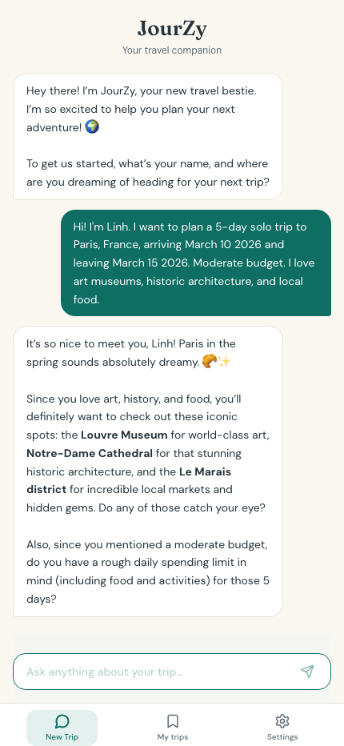
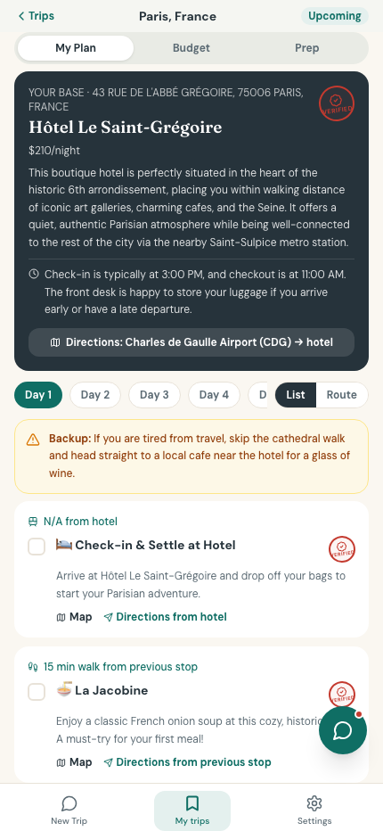
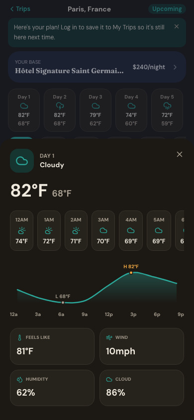

# JourZy — AI Travel Planning Agent 🗺️✨

> A conversational AI agent that turns a natural-language chat into a complete, personalized travel itinerary — lodging, attractions, routing, live weather, and packing lists — grounded in real-time data.

<p align="center">
  
  
  
  
  
  
</p>

**🌐 Live demo:** [travel-planner-ai-five-peach.vercel.app](https://travel-planner-ai-five-peach.vercel.app/)

---

## 💡 Why I built this

My parents live in Vietnam and love to travel, but planning a trip in a country they've never visited — booking flights, finding hotels, figuring out how to get around — is genuinely hard for them. My sister and I live abroad, so they'd constantly call us to plan every detail over FaceTime.

So I built JourZy: an AI travel concierge that acts as a personal tour guide in their pocket. You have a conversation with it, and it produces a full, day-by-day plan grounded in real maps, live weather, and local context — the way a knowledgeable friend would, available any time.

What started as a tool for my parents is now used by 5+ friends and family, and I've kept iterating it based on how they actually use it (a voice interface is the next feature, driven directly by user requests).

---

## 🎬 Demo

<table>
<tr>
<td width="33%">

**Conversational onboarding**


</td>
<td width="33%">

**Personalized itinerary**


</td>
<td width="33%">

**Live weather + packing list**


</td>
</tr>
</table>

---

## 🧠 How it works

JourZy is an **agentic pipeline**: a conversation drives a structured planning workflow that fans out to multiple real-time data sources, then composes everything into a single itinerary.

```
User chat ──▶ Conversational onboarding (LLM)
                     │  builds a structured traveler profile
                     ▼
              Itinerary generation (LLM)
                     │  emits deterministic, schema-checked JSON
        ┌────────────┼───────────────┬──────────────┐
        ▼            ▼               ▼              ▼
   Google Places  OpenWeather   Google Maps     Flight
   (geocode,      (5-day live    (routing,      deep-links
    place data)    forecast)      geocoded pins)
        └────────────┴───────────────┴──────────────┘
                     ▼
        Composed itinerary UI (React + TS)
   schedule · map routes · weather · packing · local tips
```

---

## 🔧 Engineering highlights

The interesting problems in this project weren't the UI — they were making an LLM **reliable enough to build a product on top of**:

- **Deterministic structured output.** The planner prompts are engineered to emit strict, schema-conformant JSON with inline rationales, so the frontend can parse and render itineraries reliably instead of babysitting free-form text.
- **Multi-provider LLM with graceful fallback.** Primary generation runs on **Gemini 2.5 Flash**; if no API key is configured, the server automatically falls back to a **local Ollama `gemma3`** instance — the same pipeline runs online or fully offline.
- **Real-time grounding.** Every itinerary is grounded in live data — Google Places for geocoding/place details, OpenWeather for a 5-day forecast, and Google Maps for routing between stops — so recommendations reflect actual conditions, not just the model's training data.
- **Weather-aware reasoning.** The packing list and safety advisories are generated from the live forecast (feels-like temperature, wind, humidity, cloud cover), so the output adapts to the real destination and dates.
- **Shipped end-to-end, solo.** Designed, built, and deployed independently — from prompt design and API integration through the React/TypeScript frontend to production deployment on Vercel.

---

## ✨ Key features

- **Conversational onboarding** — chat with JourZy about your interests, food tastes, and pace; it explores your profile until you're ready to generate.
- **Live 5-day weather** — tap any day for a detailed overlay (feels-like temp, cloud cover, pressure, wind, humidity) plus an hourly temperature trend curve and a dynamic safety/packing advisory.
- **Interactive routing** — embedded Google Maps with geocoded pins for every stop, route tracing between them, and one-click deep-links to the official Place panel.
- **AI packing checklist** — destination- and weather-aware lists grouped by Clothing, Footwear, Toiletries, Tech, Health, and Cultural considerations.
- **Local tips & flights** — AI-curated safety alerts, greeting etiquette, and cultural notes, plus deep-link booking cards across Google Flights, Skyscanner, and Expedia.

---

## 🧰 Tech stack

| Layer | Technology |
|---|---|
| Frontend | React (Vite), TypeScript |
| Backend | Node.js, Express |
| LLM | Gemini 2.5 Flash (primary), Ollama `gemma3` (local fallback) |
| Data APIs | Google Places, Google Maps, OpenWeather |
| Deployment | Vercel |

---

## 🚀 Getting started

### Prerequisites

- **Node.js** v18+
- **npm** or **yarn**
- API keys:
  - [Google Gemini API key](https://ai.google.dev/) — AI generation & conversational chat
  - [Google Maps API key](https://console.cloud.google.com/) — geocoding, place details, maps embed
  - [OpenWeather API key](https://openweathermap.org/api) — live 5-day weather

### 1. Backend

```bash
cd backend
npm install
```

Create a `.env` file inside `/backend`:

```env
PORT=8888
GEMINI_API_KEY=your_gemini_api_key
GOOGLE_MAPS_KEY=your_google_maps_key
OPENWEATHER_API_KEY=your_openweather_api_key
```

Start the API server:

```bash
node server.js
# runs at http://localhost:8888
```

### 2. Frontend

```bash
cd frontend
npm install
npm run dev
# loads at http://localhost:5173
```

### Optional: local LLM fallback (Ollama)

If `GEMINI_API_KEY` isn't set, the server falls back to a local Ollama instance:

```bash
ollama serve
ollama pull gemma3
```

---

## 🗺️ Roadmap

- [ ] Voice interface (top user-requested feature)
- [ ] Native mobile app for easier on-the-go use
- [ ] Direct flight / hotel booking integrations

---

## 📄 License

MIT — see [LICENSE](LICENSE) for details.